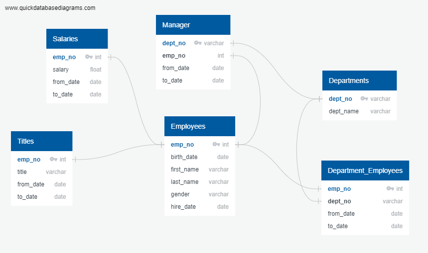
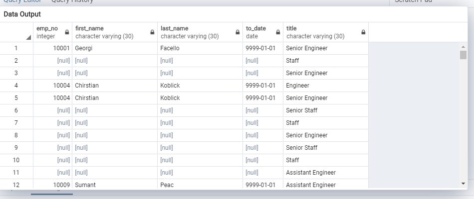
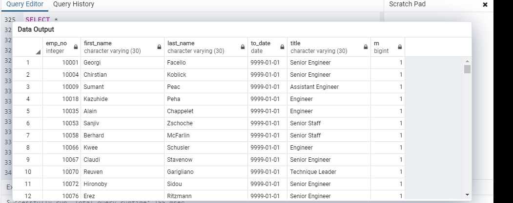
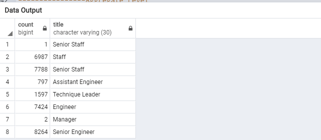
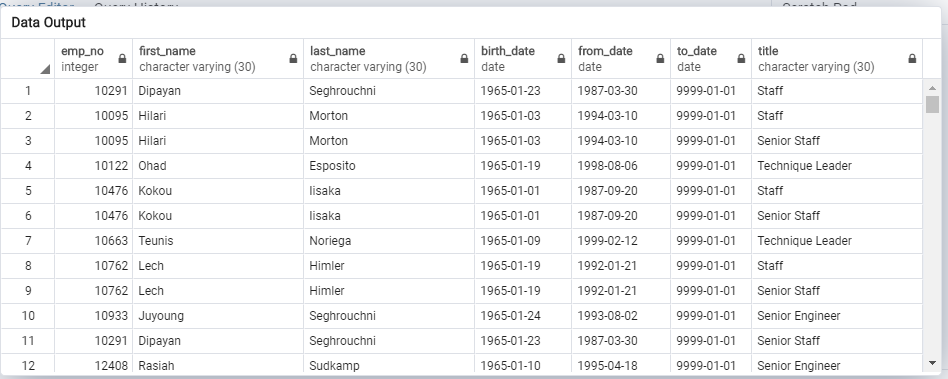

## DESCRIPTION
In this project, we learn about data modeling, engineering, and analysis. Applying our knowledge of DataFrames and tabular data, we create entity relationship diagrams (ERDs), import data into a database, troubleshoot common errors, and create queries that use data to answer questions using SQL techniques.

### SITUATION/TASK
A company's baby boomer cohort will be retiring at a rapid rate. The company wants to 
who would be retiring in the next few years, who would meet the criteria for retirement packages
and how many positions will come available as a result. The database analysis will future proof 
the company by generating a list of all employees getting ready to retire, who is eligible for the retirement package and retirees       who could be potential mentors and a resource for the company. 

### APPROACH
* Use an ERD to understand relationships between SQL tables.
* Create new tables in pgAdmin by using different joins.
* Write basic- to intermediate-level SQL statements.
* Export new tables to a CSV file.

### RESULTS
The following are the findings from the database analysis:   
* Number of Individuals retiring: 443,308
* Number of Individuals being hired: 32,860
* Number of individuals available for mentorship role:2382
             

PNG OF YOUR ERD

-----------------------------------CODE (Code for the requested queries, with examples of each output)----------------------

-----------------------Get a list of current employees eligible for retirement,including thieir most recent titles----------

SELECT cur.emp_no,
	   cur.first_name,
	   cur.last_name,
	   cur.to_date,
	   t.title
INTO ret_titles
FROM current_emp as cur
RIGHT JOIN titles as t
ON cur.emp_no = t.emp_no;

SELECT * FROM ret_titles

EXAMPLES OF EACH OUTPUT

-------------------------------- Unique &  Most Recent Titles Use Partitioning----------------------------------------
	Get the final list with recent titles, by partitioning the data so that each employee is only included on the list once.

SELECT *
INTO unique_titles
FROM
    (SELECT emp_no,
    first_name,
    last_name,
    to_date,
    title, 
	ROW_NUMBER() OVER(PARTITION BY (first_name, last_name)ORDER BY to_date DESC) AS rn
    FROM ret_titles) AS tmp 
	WHERE rn = 1
ORDER BY emp_no

SELECT * FROM unique_titles

EXAMPLES OF EACH OUTPUT

----------------------------------------------- Aggregate Level--------------------------------------------------
	In descending order (by date), list the frequency count of employee titles (i.e., how many employees share the same title?)

SELECT COUNT(title), title
INTO retiring_emp_titles
FROM unique_titles
GROUP BY title, to_date
ORDER BY to_date DESC;

SELECT * FROM retiring_emp_titles

EXAMPLES OF EACH OUTPUT

----------------------------------------------------Mentorship--------------------------------------------------------------
				Should return the potential mentor’s

SELECT e.emp_no,
	   e.first_name,
	   e.last_name,
	   e.birth_date,
	   de.from_date,
	   de.to_date,
	   t.title
INTO mentorship_info
FROM employees As e
INNER JOIN  dept_emp as de
ON de.emp_no = e.emp_no
INNER JOIN titles As t
ON e.emp_no = t.emp_no
WHERE (de.to_date = '9999-01-01')
	AND(e.birth_date BETWEEN '1965-01-01' AND '1965-12-31');

SELECT * FROM mentorship_info

EXAMPLES OF EACH OUTPUT

### THINGS LEARNED
* Designing an ERD that applies to the data.
* Creating and using a SQL database.
* Importing and exporting large CSV datasets into pgAdmin.
* Practice using different joins to create new tables in pgAdmin.
* Writing basic- to intermediate-level SQL statements.

### SOFTWARE/TOOLS
Postgres, pgAdmin

### RECOMMENDATION FOR FURTHER ANALYSIS 
Further analysis of this data set could involve querying for a list of eligible retirees per department by title by date.
